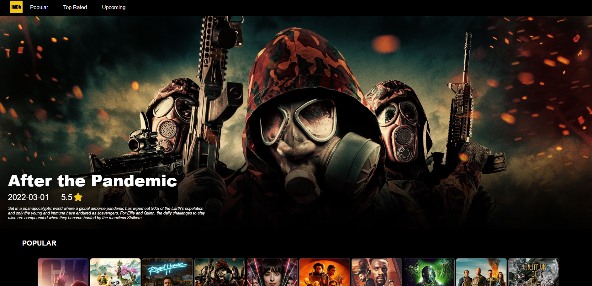
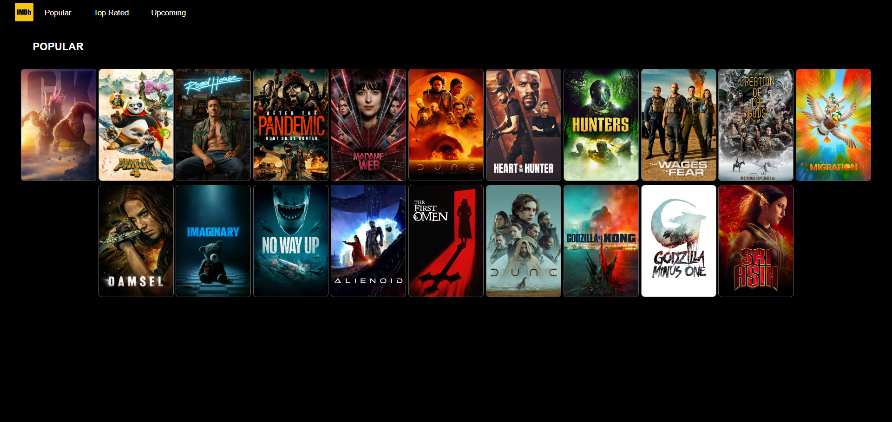
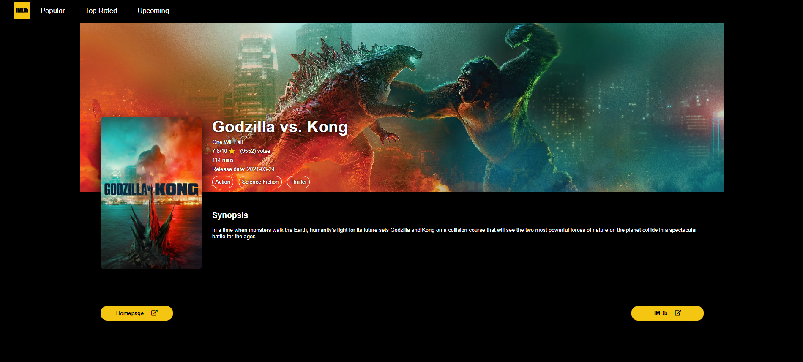

# IMDb
<pre>

</pre>

## Introduction
IMDb project is a cloning project that gets data from IMDb API. In this projects we use basic JavaScript and CSS

## Features
+ API Responds
+ Wonderful Design
+ Animations
+ Skeletons for Loading Async Rendering
